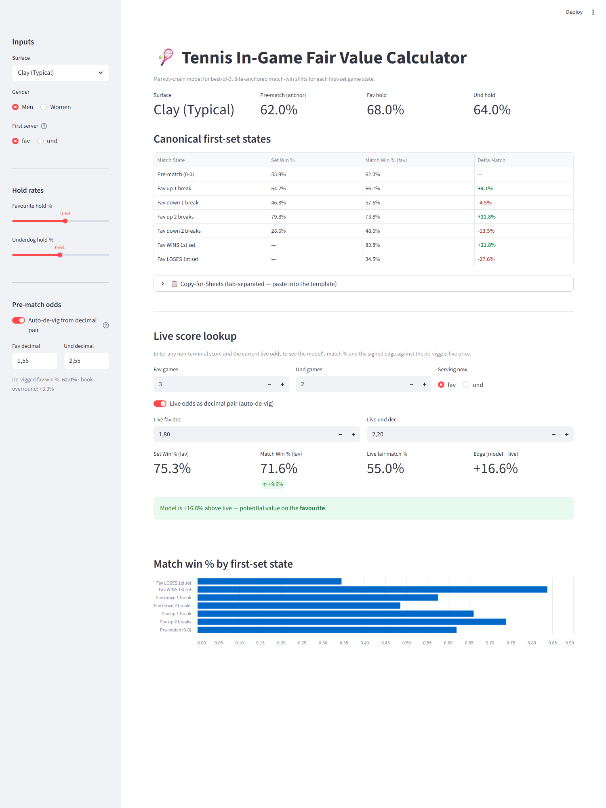

# Tennis In-Game Fair Value Calculator

A Markov-chain fair-value model for live best-of-3 tennis matches. It takes the pre-match betting line as an anchor, walks the first set game-by-game, and tells you where the *fair* match-win probability should sit at each key state — so you can compare against the live market and spot when retail money has pushed the price away from fundamentals.



---

## Quick start

Requires **Python 3.10+**.

```bash
git clone https://github.com/AdrianRuudWiker/tennis_fair_value.git
cd tennis_fair_value
python -m venv venv
venv\Scripts\activate         
pip install -r requirements.txt

streamlit run src/app.py
pytest tests/                   
```

The Streamlit app opens in your browser; the sidebar has every input, the canonical first-set table updates live, and there's a per-score lookup panel at the bottom.

---

## Terminology

Short reference so the rest of the README reads cleanly. Skip if you know these.

**Tennis**
- **Hold (of serve)** — winning a game you served. "**Hold rate**" = fraction of service games you win over time.
- **Break (of serve)** — winning a game your opponent served. "Up/down N breaks" = N net breaks ahead/behind.
- **Tiebreak** — the mini-game played at 6-6 to decide the set.
- **ATP / WTA** — the men's and women's professional tennis tours.

**Betting**
- **Decimal odds** — price format where `1.53` means a $1 bet returns $1.53 total. Implied probability = `1 / decimal`.
- **Overround / vig** — the bookmaker's built-in margin. When the two sides' implied probabilities sum to more than 100 %, the excess is the overround. "**De-vig**" means removing it to recover a fair two-sided probability.
- **Sharp money vs fan money (retail money)** — professional / informed bettors vs casual / emotion-driven bettors. Sharp money dominates pre-match lines on low-margin books; fan money dominates live markets on retail venues.
- **Fair value** — the "correct" probability or price, absent bias, noise, or book margin.
- **Edge** — the gap between the model's fair probability and the market's offered probability. A positive edge means the market is mispriced in your favour.
- **Pinnacle** — a sportsbook famous for sharp, low-margin lines; widely used as the efficient-market reference.

**Model / code**
- **Markov chain** — a state-based model where each next-state probability depends only on the current state, not the history. Here: game scores and who serves next.
- **Memoise** — cache a function's result keyed on its inputs so repeated calls are free.
- **Anchoring** — locking the absolute level to an external number (the pre-match odds) and using the model only to compute the *shift* from that anchor.
- **fav / und** — short for "favourite" / "underdog" throughout the code and UI.

---

## The problem it solves

**Pre-match markets are efficient. In-match markets are not.**

By the time a match starts, sharp bettors have had days to balance the line on a low-margin book like Pinnacle. The pre-match price is usually a good read on the true win probability.

Once the ball is in play, everything changes. In-match volume concentrates on retail venues — Bet365, DraftKings, Polymarket, in-app sportsbooks — where most of the money is recreational. Fans bet on the player they want to win. Bettors over-react to a break. People fire a gut call in between points. The live market becomes a weighted average of *sharp money* and *fan money*, and fan money has consistent biases:

- **Overreacts to breaks**, especially early in a set.
- **Underweights serve-hold dynamics** — casual bettors don't internalise that a break on clay is a much smaller deal than a break on grass.
- **Trades narrative, not probability** — "he's finished" after a dropped set; "unstoppable" after a hot start.

These biases push the live line away from fair value. If we can compute cleanly what the price *should* be — the pre-match anchor plus the mechanical effect of the current scoreline — the gap between our number and the live market is the edge.

That's what this tool does.

---

## How the model arrives at the answer

Four steps. Each is purely mechanical — no judgment calls.

**1. Anchor to the pre-match market.** We trust the de-vigged pre-match line as the "correct" baseline match-win probability. No pretending the model prices a match better than a sharp book with days of volume behind it.

**2. Walk the set with a Markov chain.** Given each player's serve-hold rate on the surface, recurse through every reachable future game from the current state. At each game, the server either holds (with probability = their hold rate) or is broken. Memoise, so each unique state is computed once. The result: the exact probability the favourite wins *this set*, from any game score and server.

**3. Roll set outcomes up to match outcomes.** Best-of-3 has a closed-form: `P(match | p_set) = p² · (3 − 2p)`. Combined with the law of total probability on the first-set outcome, we get a match-win number for every first-set game state:
```
P(match | state) = P(win set) · P(match | 1-0 sets) + P(lose set) · P(match | 0-1 sets)
```

**4. Shift, don't replace.** The model's *raw* match-win number will disagree with the sharp pre-match line for dozens of reasons the model doesn't know — injuries, H2H, form, weather, surface familiarity. So we compute only the *shift* the model predicts as the set unfolds and apply it to the anchor:
```
match_win_fav(state) = prematch_odds + (model_at_state − model_pre_match)
```
**The market sets the level. The Markov chain sets the motion.** This is the key honesty move.

---

## A worked example

A men's hard-court match. Pre-match book prices: favourite **1.53**, underdog **2.55**. De-vig to remove the book's margin:
```
p_fav = (1/1.53) / (1/1.53 + 1/2.55) ≈ 0.625    → 62.5 % baseline
```

Hold rates on hard court: fav **0.84**, underdog **0.78** (fav is stronger on serve but only by a few points).

Run the model — the canonical table comes back:

| State | Match Win % (fav) | Delta Match |
|---|---|---|
| Pre-match (0-0) | 62.5 % | — |
| Fav up 1 break | 64.9 % | +2.4 % |
| Fav down 1 break | 59.6 % | −2.9 % |
| Fav up 2 breaks | 74.9 % | +12.4 % |
| Fav down 2 breaks | 46.6 % | −15.9 % |
| Fav WINS 1st set | 81.5 % | +19.0 % |
| Fav LOSES 1st set | 33.6 % | −28.9 % |

### Now the set starts.

At **2-3, favourite serving**, the underdog has broken early. The live book moves:
- Live favourite price: **2.05** (drifts out)
- Live underdog price: **1.78**
- De-vig: `(1/2.05) / (1/2.05 + 1/1.78) ≈ 46.5 %` — the market is pricing the fav at ~46.5 % match win.

The model, for the mid-set state `(2, 3, fav)`:
- Set win (fav): **50.9 %** — fav is behind on serve but on-serve has similar chance
- Anchored match win (fav): **58.0 %** (shift of −4.5 % from pre-match)

**Gap: 58.0 % − 46.5 % = +11.5 % in favour of the favourite.**

This is exactly the retail-flow pattern: fan money sells the favourite hard on an early break, the live line over-reacts, and the model's disciplined "one break on hard court is worth about −4.5 % to the fav's match probability" reads through the noise.

Whether you *act* on that gap is a separate decision — model risk, liquidity, bankroll. But this is what **spotting** looks like.

---

## How to run

### Streamlit app (recommended for live use and demos)
```bash
pip install -r requirements.txt
streamlit run src/app.py
```
All inputs live in the sidebar (with an auto-de-vig toggle for the pre-match prices). The canonical table, live-score lookup, and bar chart recompute as you change any number.

### Command line (for reproducible CSV exports)
```bash
# First time only
python -m venv venv
venv\Scripts\activate          # Windows
pip install -r requirements.txt

# Edit src/main.py: set SURFACE, GENDER, FIRST_SERVER, hold rates
cd src
python main.py                 # prints the table, exports a timestamped CSV
python main.py --live          # interactive score-by-score mode
```

---

## Inputs

| Field | Where to get it | Notes |
|---|---|---|
| Surface | Match listing | Slow Clay · Clay (Typical) · Hard Court · Grass/Fast Hard |
| Pre-match odds | Sharp book (Pinnacle, etc.) | Feed the raw decimal pair; the app auto-de-vigs |
| Fav / Und hold rates | tennisabstract.com "Splits" tab or ultimatetennisstatistics.com | Current-season, surface-specific |
| First server | Coin toss — announced on-air minutes before play | |

Hold rates are decimal fractions (68 % → `0.68`).

---

## Output table

```
Match State             Set Win%   Match Win% (fav)   Delta Match
-----------------------------------------------------------------
Pre-match (0-0)            58.9%              64.0%            --
Fav up 1 break             63.7%              66.3%         +2.3%
Fav down 1 break           53.2%              61.2%         -2.8%
Fav up 2 breaks            86.1%              77.2%        +13.2%
Fav down 2 breaks          25.1%              47.6%        -16.4%
Fav WINS 1st set              --              83.9%        +19.9%
Fav LOSES 1st set             --              35.5%        -28.5%
```

**How to read it:** the *Match Win % (fav)* column is what the favourite's match-win price *should* be at each state. Compare to the de-vigged live price. Difference is the edge.

A CSV is written to `outputs/` with a `#`-prefixed metadata header (surface, hold rates, anchor, timestamp).

---

## Live mode (CLI)

```
  Score > 3 2 fav 0.71
  3-2 fav srv  |  set: 58.9%  match fav: 63.1% (-0.9%)   edge: -7.9%
```

Type `fav_games und_games server [optional de-vigged live odds]`. Terminal scores (6-4, 7-5, 7-6) are rejected — those belong on the *WINS/LOSES 1st set* row of the main table.

The Streamlit app has the same lookup with auto-de-vig on both sides, plus a signal banner that flags when the edge exceeds model noise (~3 %).

---

## Assumptions — and why each was chosen for v1

| Assumption | Rationale |
|---|---|
| **Best-of-3 only** | Covers most ATP/WTA regular-season matches. Bo5 is a one-line extension; deferred for scope. |
| **Favourite serves first** (default) | Spec assumption; avoids blocking on the coin-toss result. Override in the app if needed. |
| **Canonical `(0, 1, fav)` for "down 1 break"** | v1 uses the canonical form to keep the table compact and the Markov recursion state-history-free. The true "just broken" state is `(0, 1, und)` — strictly worse probabilistically but requires tracking exact in-set history. Trade-off: on high-hold surfaces (grass, fast hard) the table *understates* the sting of an early break. Flagged, not hidden. |
| **Hold rates constant through the match** | No momentum, fatigue, or pressure adjustment. Second-order effects we leave on the table for v2. |
| **Tiebreak = `fav_hold / (fav_hold + und_hold)`** | A point-by-point tiebreak chain changes the number by ~1–2 %. The approximation is tight enough for edge-spotting and keeps the model one-file-simple. |
| **Sets 2 and 3 reset to neutral** | No set-to-set momentum. Slightly undersells the match-level consequence of winning/losing the first set — conservative. |
| **Pre-match row shows the book's de-vigged odds exactly** | The model contributes motion, not level. A sharp book knows things the Markov chain doesn't. |

---

## Sanity checks (run automatically by pytest)

| Property | Test |
|---|---|
| Equal hold rates → exactly 50 % set win | `test_equal_holds_set_win_50pct` |
| Pre-match row of table == de-vigged site odds | `test_prematch_row_anchored_to_site_odds` |
| Pre-match delta is `None` (nothing to compare against) | `test_prematch_row_delta_match_is_none` |
| Up-break states > neutral; down-break states < neutral | `test_{up,down}_states_above/below_neutral_set_win` |
| Delta ordering: `won > up2 > up1 > 0 > down1 > down2 > lost` | `test_delta_match_signs_and_ordering` |
| Mirror symmetry with equal holds: `P(up 1 break) + P(down 1 break) = 1` | `test_mirror_symmetry_equal_holds` |
| Site-anchoring identity holds for every row | `test_site_anchoring_is_correct` |
| `delta_match` == `match_win_fav − prematch_odds` | `test_delta_match_equals_anchored_shift` |
| Extreme hold rates (0, 1, 0.99/0.01) do not crash | `test_{zero,unit}_hold_rates_no_crash`, `test_extreme_favourite_no_crash` |

```bash
pytest tests/ -v
```

---

## Google Sheets workflow

1. In the Streamlit app, expand the **📋 Copy-for-Sheets** block and copy the TSV. Paste directly into the target Sheets template.
2. Or, after a CLI run, open the generated `outputs/*.csv` — the `#`-prefixed metadata rows are at the top, the table below.

---

## Known gaps in v1 (tracked deliberately, not overlooked)

- **No data-source integration.** Hold rates are typed by hand from tennisabstract.com. Automating `data source → Python engine` is a v2 priority — see the Whiteboard.
- **Per-player × per-surface hold profiles are not first-class inputs.** The app takes the two holds *for the currently selected surface*, not a full 4-surface profile per player. Adding that is ~20 lines of form; deferred because v1's goal was the model, not the data-entry ergonomics.
- **Output column layout is my own choice.** Column order and headers reflect what I judged to fit the Sheets workflow; easy to reconcile against any canonical layout if one is supplied later.

---

## Whiteboard: where v2+ can take this

Running list of ideas that would make the model *more correct*, not just more featureful. Each is noted with **what it changes**, **why it matters**, and **rough effort**.

### Model mechanics (the math itself)

- **Break timing within a set.** Right now every "down 1 break" state is the same canonical `(0,1,fav)`. But being broken at 0-1 (10 games left to break back) is very different from being broken at 4-5 (1 game left). Replacing the canonical with the *actual game-state* would be a direct accuracy upgrade on the 1-break and 2-break rows. *Effort: small — remove the canonical, accept the real state as input.*

- **Set-to-set momentum.** v1 assumes sets 2 and 3 restart from neutral `p_set_neutral`. In reality, winning set 1 correlates positively with winning set 2 (confidence, opponent frustration, server warm) beyond what's explained by hold rates alone. Could be modelled as a **set-win multiplier** learned from historical data, or as a Bayesian update on the hold rate itself. *Effort: medium — needs a data pull to calibrate the multiplier.*

- **Point-by-point tiebreak.** Replace `fav_hold / (fav_hold + und_hold)` with a proper Markov chain on points (needs a per-player point-win-on-serve rate, not game hold rate). Changes the number by ~1–2 %, but removes a known approximation. *Effort: small — one more file `tiebreak.py`.*

- **Fatigue / late-match decay.** Hold rates tend to drop in long matches, especially on hot days. Model as a linear decay with total-games-played. *Effort: medium — needs calibration data.*

- **Pressure-point sensitivity.** Hold rates on break points, set points, match points differ from the overall serve-hold %. A "big-point factor" for each player would feed through to tighter late-set and late-match numbers. *Effort: medium-high — data-hungry.*

- **Best-of-5 support.** Grand Slam matches. Set-level logic is unchanged; the match-layer closed-form changes to `P(3-0) + P(3-1) + P(3-2)`. *Effort: small — new formula in `match.py`.*

### Inputs (the data)

- **Head-to-head history.** If two players have met 10 times and the "favourite" has won 3, that's a signal the pre-match anchor may already capture — but the *in-game shift* might still need adjustment (some matchups produce break-heavy sets regardless of surface). *Effort: medium — needs a H2H data feed.*

- **Recent-form-weighted hold rates.** Instead of "season average on this surface", use an exponentially-weighted moving average over the last N matches on this surface. Captures injuries, slumps, hot streaks. *Effort: medium.*

- **Player-specific serve-vs-return profiles.** Elo-on-serve and Elo-on-return, instead of flat hold rates. Lets the model compare dissimilar players more cleanly. *Effort: high — a ratings system is a project in itself.*

- **Surface-transition effects.** A player just off clay playing their first hard-court match tends to under-perform their hard-court average. *Effort: small, once you have a data source.*

- **Full 4-surface profile per player as first-class inputs.** The spec asks for this but v1 takes only the current-surface pair. *Effort: trivial UI change.*

### Market / deployment

- **Live odds scraping.** Pull live prices from Pinnacle (sharp anchor), Bet365 / Polymarket (retail venues) — auto-de-vig, auto-compute edge. *Effort: medium — scraping is fragile; rate limits matter.*

- **Backtesting against historical matches.** Replay completed matches with the model running at each game, log model-vs-market gap alongside actual outcome, measure whether "+X% edge" bets actually realise that edge over a large N. This is how you *validate* the tool, not just unit-test it. *Effort: high — but it's the real proof of value.*

- **Confidence intervals on the output.** Hold rates are themselves estimates. Propagating a ±2 % uncertainty on each hold rate through the Markov chain gives a range on Match Win %, not just a point estimate. Useful for bankroll / Kelly sizing. *Effort: medium — bootstrap or analytical.*

- **Automated edge alerts.** When live gap crosses a threshold for a tracked match, send a notification. *Effort: low once scraping works.*

### Longer-term ideas

- **Bayesian updating of hold rates as the match proceeds.** If the fav is holding way below their historical rate after 4 service games, the prior should shift. Keeps the model responsive to within-match information.
- **Doubles support.** Different dynamics — serve rotation, I-formation returns, etc.
- **Other sports with similar structure** (table tennis, volleyball, snooker frames) — the Markov-chain-over-scoring-states framework generalises.

---

## Further reading

- [`docs/technical-walkthrough.md`](docs/technical-walkthrough.md) — plain-English tour of the code, layer by layer, with the five transferable patterns.

---

## Project structure

```
tennis_fair_value/
├── src/
│   ├── states.py     # Terminal-state detection for set scores
│   ├── markov.py     # Set-level Markov chain with memoisation
│   ├── match.py      # Best-of-3 match-win formulas
│   ├── main.py       # CLI orchestration, CSV export, live mode
│   └── app.py        # Streamlit UI (inputs, canonical table, live lookup)
├── tests/
│   ├── conftest.py
│   └── test_sanity.py
├── docs/
│   ├── technical-walkthrough.md
│   └── ui-screenshot.png
├── outputs/          # Generated CSVs (git-ignored)
├── requirements.txt
└── README.md
```
